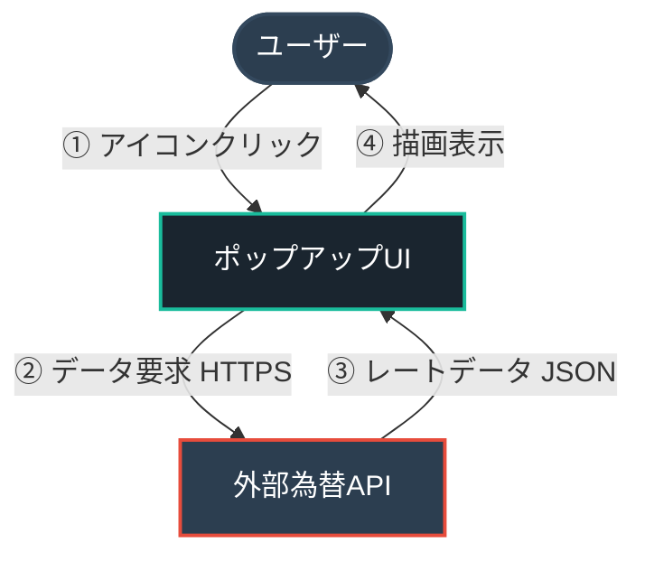
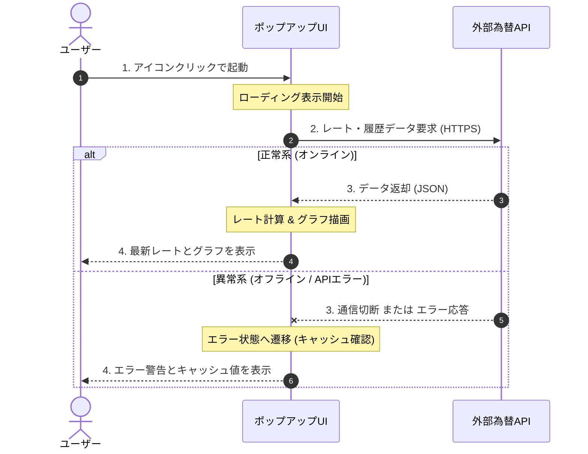

# ソフトウェア要求仕様書 (SW105)

## 1. 概要

### 1.1 目的と位置づけ
本ソフトウェアは、Google Chromeブラウザ上で動作し、現在のドル円（USD/JPY）為替レートおよび過去24時間の価格推移をユーザーに即座に提供するためのChrome拡張機能である。デスクトップ上で作業しながら、ワンクリックで為替市場の最新動向を美しく直感的なインターフェースで把握できるようにすることを目的とする。

### 1.2 適用範囲
本仕様書は、Chrome拡張プログラム（フロントエンドUI、バックグラウンド処理、外部API連携部）のすべての機能および非機能要件を適用範囲とする。

### 1.3 用語定義
| 用語 | 定義 |
| :--- | :--- |
| **Chrome拡張** | Google Chromeブラウザの機能を拡張するためのプログラム。 |
| **Manifest V3** | Chrome拡張プログラムの現在の標準仕様・プラットフォームバージョン。セキュリティとパフォーマンスが向上している。 |
| **ポップアップ** | 拡張機能のアイコンをクリックした際に表示される小さなHTMLウィンドウ。 |
| **API** | 外部のサーバーから為替データを取得するためのApplication Programming Interface。 |

---

## 2. システム全体構成

### 2.1 システム構成概要

### 2.2 ソフトウェアの構成要素
本システムは以下のファイル群で構成される：
1. `manifest.json`: 拡張機能のメタデータおよび権限設定ファイル (Manifest V3準拠)
2. `popup.html`: ポップアップウィンドウのUI構造定義ファイル
3. `popup.js`: API通信、データ解析、グラフ描画、エラー処理を担当するロジックファイル
4. `popup.css`: 美しくモダンなUIスタイルを定義するスタイルシート
5. `assets/`: アイコン画像などのリソース（16x16, 48x48, 128x128）

---

## 3. 制約条件と前提事項

### 3.1 ハードウェア制約
* Google Chromeブラウザが正常に動作するPC環境全般（Windows, macOS, Linux等）。
* ディスプレイ解像度に依存せず、ポップアップが適切に収まるサイズであること。

### 3.2 ソフトウェア環境
* 動作環境: Google Chrome バージョン 88 以降 (Manifest V3をサポートするバージョン)。
* 開発言語: HTML5, Vanilla CSS, JavaScript (ES6+)。外部フレームワーク（React, Vue等）は使用せず、軽量化のためネイティブJSで構築する。
* グラフ描画ライブラリ: パフォーマンスと軽量性を重視し、SVGによる自作描画、あるいは極めて軽量なCDNリンク経由のライブラリ（Chart.jsなど）を使用する。

### 3.3 準拠規格
* Google Chrome Extension Manifest V3 開発ガイドラインに完全準拠する。

---

## 4. 機能要求

### 4.1 ユースケースとシナリオ

### 4.2 機能詳細

#### 4.2.1 起動およびローディング処理
* **優先度**: MUST
* **入力**: ユーザーによるブラウザの拡張機能アイコンクリック。
* **処理**: ポップアップウィンドウを起動し、即座にローディングアニメーション（微細で美しいインジケータ）を表示しながらAPI通信を開始する。
* **出力**: ポップアップ画面の初期表示。
* **検証条件 (Acceptance Criteria)**:
  1. アイコンクリックから100ms以内にポップアップウィンドウが表示されること。
  2. API通信の完了またはタイムアウトが発生するまでの間、ローディングアニメーション（骨格スクリーンまたは回転インジケータ等）が適切に描画され続けること。

#### 4.2.2 為替データの非同期取得
* **優先度**: MUST
* **入力**: 起動シグナル。
* **処理**: 外部APIに対し、非同期（fetch）でドル円（USD/JPY）の「最新レート」および「過去24時間の履歴データ（1時間ごと）」を取得する。通信のタイムアウト時間は「5秒」とする。
* **出力**: JSON形式の為替データ。
* **検証条件 (Acceptance Criteria)**:
  1. 起動後、即座に指定APIサーバーへ対しHTTPSによる非同期リクエストが実行されること。
  2. 通信が5秒以内に完了しなかった場合、自動的にタイムアウトエラー（AbortController等を利用）として例外処理に遷移すること。

#### 4.2.3 最新レートの表示
* **優先度**: MUST
* **入力**: 取得した最新のドル円レート数値。
* **処理**: 小数点以下3桁まで四捨五入してフォーマットする。
* **出力**: ポップアップ上部に「ドル円」のラベルと、「XXX.XXX円」のテキストを大きく表示。
* **検証条件 (Acceptance Criteria)**:
  1. 「ドル円」または「USD/JPY」の明確なラベルが存在すること。
  2. レート値が「148.256」のように、常に小数点以下3桁まで表示されること（例: 小数点以下2桁だった場合も「148.200」のようにゼロパディングすること）。

#### 4.2.4 過去24時間の価格推移グラフ描画
* **優先度**: MUST
* **入力**: 過去24時間のドル円レート推移データ（24個の時系列データ）。
* **処理**: 取得データの最高値・最安値を自動計算してY軸のスケールを自動調整し、ポップアップ下部に美しいグラデーションを持つ折れ線グラフを描画する。また、グラフ領域の右端にY軸領域を確保し、期間内の最高値・最安値をテキスト表示するとともに、現在レートの垂直位置に連動する左向き矢印（◀）および現在レートの数値（現在値ラベル）を動的にプロットする。
* **出力**: ポップアップ内の折れ線グラフエリア（グラフ線、Y軸数値、現在値矢印インジケータ）。
* **検証条件 (Acceptance Criteria)**:
  1. ポップアップ下部のグラフエリアに、24点のデータポイントを結ぶ滑らかな折れ線グラフ（ラインチャート）が描画されること。
  2. Y軸のスケールが最高値と最安値に応じて自動フィットし、データの差異が視覚的に明確に判別できること。
  3. 折れ線の下部に、透明度のある美しいグラデーション塗りが適用されていること。
  4. グラフの右端にY軸領域（幅40px〜50px程度）が配置され、期間内の最高値および最安値がテキストで縦並びに表示されること。
  5. グラフ上の最新レート（現在値）の高さに対応するY軸上の位置に、左向きの矢印（◀）と現在値を示す数値（例: `148.234`）が動的に描画されること。

#### 4.2.5 エラーハンドリングおよびオフライン対応 (異常系)
* **優先度**: MUST
* **入力**: API通信時の例外発生（ネットワーク未接続、APIサーバーダウン、5秒以上のタイムアウト等）。
* **処理**:
  1. `navigator.onLine` によるオフライン判定、および `fetch` 時の例外キャッチ。
  2. データを取得できなかった場合、画面全体を「エラー表示モード」に切り替える。
  3. 「オフラインのためデータを取得できません」または「サーバーと通信できません」のメッセージを表示する。
  4. 直近の正常取得データがキャッシュ（chrome.storage等）されている場合、「最終更新日時：YYYY/MM/DD HH:mm」とともにキャッシュレートを表示する（フォールバック表示）。キャッシュの最大有効期限は「24時間」とし、期限超過時は完全なエラー表示とする。
  5. ユーザーが手動で復旧を試みられるよう、「再試行（Reload）」ボタンを表示する。ボタン押下時は再度ローディングから通信を再開する。
* **出力**: エラー画面、キャッシュデータ（存在する場合）、および再試行インターフェース。
* **検証条件 (Acceptance Criteria)**:
  1. ネットワーク切断状態（オフライン環境）で起動した場合、即座にエラーメッセージが表示されること。
  2. ネットワーク切断時であっても、過去24時間以内に保存された有効なキャッシュが存在する場合は、そのレートと最終取得日時が画面に表示されること。
  3. 「再試行」ボタンをクリックした際、ポップアップを閉じずに再リクエストが行われ、オンライン復帰時には正常に最新レートとグラフが表示されること。

---

## 5. 外部インタフェース要求

### 5.1 ユーザインタフェース (UI)
* **デザインコンセプト**: 高級感のあるダークテーマをデフォルトとし、ネオン調のアクセントカラー（例: エメラルドグリーンやサイアン）を用いた視認性の高いモダンデザイン。
* **レイアウト要件**:
  * ポップアップサイズ: 横幅 320px 〜 360px、縦幅 400px 〜 450px。
  * ヘッダー: 「ドル円」および「USD/JPY」のシンボル表示。
  * メインレート: フォントサイズを大きくし、視認性の最優先（例: `36px` 程度）。
  * グラフエリア: 滑らかなカーブを描く折れ線グラフ。塗りつぶしには美しいグラデーション（半透明）を適用。右端にはマージンを設け、縦方向のY軸（最高値・最安値表示、現在レートの矢印ポインタと数値テキスト）を表示。
  * フッター: 最終更新時間またはAPI提供元クレジットの表示。
* **アニメーション**: フェードインや滑らかなローディング演出を取り入れ、プレミアム感を演出する。

### 5.2 ハードウェアインタフェース
* 該当なし。

### 5.3 ソフトウェアインタフェース
* **データAPI**: Yahoo Finance API、または登録不要でUSD/JPYレートおよびヒストリカルデータを取得できるパブリックAPIを利用する（例: `yfinance` 互換のエンドポイント、あるいは迅速なモック/本番切り替え可能なカスタム構成）。
* **通信仕様**: すべてHTTPS暗号化通信で行う。

---

## 6. 非機能要求（性能・品質等）

### 6.1 性能・効率性
* **応答速度**: アイコンクリックからポップアップ表示およびデータ描画完了まで、オンライン時は「1.2秒以内」を目標とする（APIサーバーの応答時間を除くローカル処理は100ms以内）。
* **軽量性**: 拡張機能のパッケージ容量を極力小さく保ち（1MB未満）、ブラウザのメモリやCPUに負荷をかけないこと。

### 6.2 信頼性・安全性
* **フォールバック**: ネットワーク障害時、一切の表示が消えてフリーズするような事態を防ぎ、エラーメッセージと前回のキャッシュ値を確実に表示する。
* **データ整合性**: APIから異常な値（例: 0円や負の値）が返ってきた場合は不正データとみなし、エラーとして処理する。

### 6.3 保守性・拡張性
* 拡張機能のコードはクリーンでモジュール化されたJavaScriptで構成し、将来的に他の通貨ペア（ユーロ円、ポンド円等）を追加しやすい設計とする。

### 6.4 セキュリティ
* **CSP (Content Security Policy)**: Manifest V3のセキュリティ基準に則り、インラインスクリプトの実行を禁止し、許可された安全なAPIドメインとのみ通信を行う。

---

## 7. その他・特記事項

### 7.1 今後の確認事項（TBD）
* **利用APIの確定**: 開発開始にあたり、本番環境で永続的かつ無料で利用可能な軽量為替APIを選定する。候補が制限される場合は、GitHub Pages等でホストするテスト用静的JSON、またはYahoo FinanceのパブリッククエリURL等を比較検討する。
