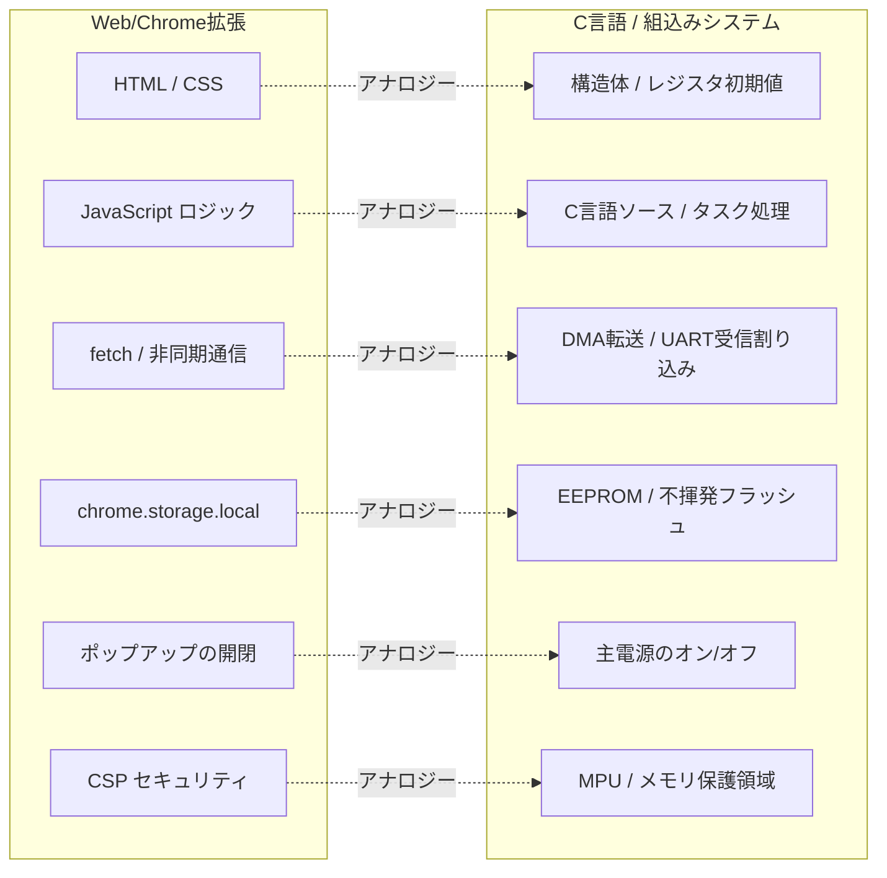
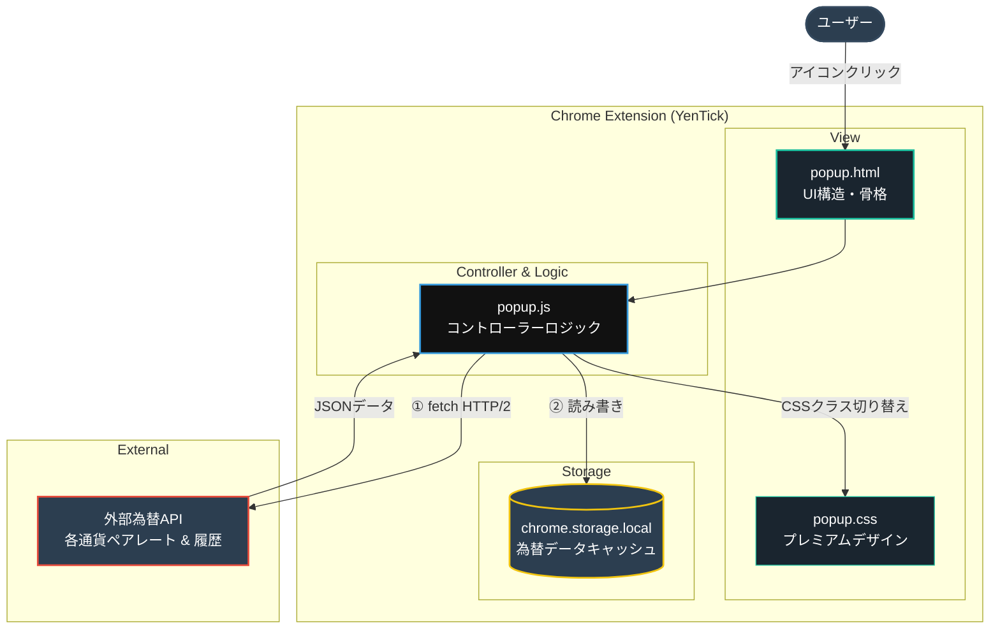
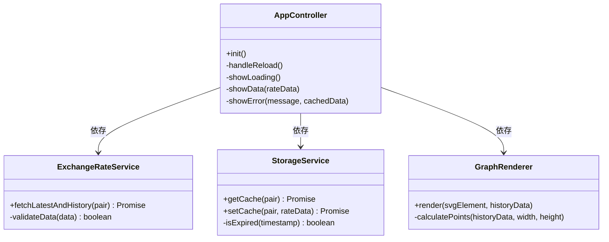
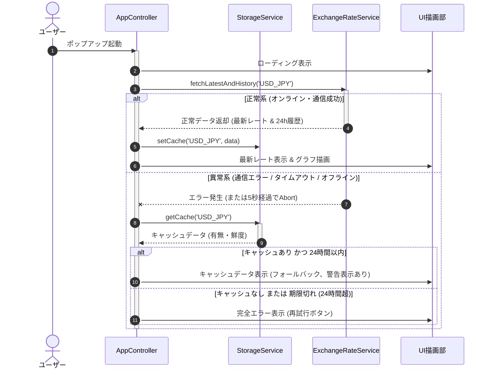

# ソフトウェアアーキテクチャ設計書 (SW205)

## 1. 概要

### 1.1 目的と位置づけ
本ドキュメントは、現在のドル円（USD/JPY）為替レートおよび過去24時間の価格推移を即座に表示するChrome拡張機能「YenTick」のソフトウェアアーキテクチャ設計を定義する。ソフトウェア要求仕様書（SW105）に示された要求事項を技術的に実現するための静的構造、動的振る舞い、制御方式、およびインターフェースを明確にし、実装における品質と一貫性を保証することを目的とする。

### 1.2 適用範囲
本仕様書は、Chrome拡張機能（Manifest V3準拠）として動作する以下のコンポーネントを適用範囲とする。
* ポップアップUI構造・スタイル定義（`popup.html`, `popup.css`）
* ポップアップロジック・制御処理（`popup.js`）
* データストレージおよび外部通信インターフェース
* 異常系処理およびフォールバック制御
* 静的アセット管理およびマニフェスト定義（`assets/icon-128.png`, `manifest.json`）

### 1.3 参照ドキュメントおよびトレーサビリティ
* **参照ドキュメント**: ソフトウェア要求仕様書 (SW105)
* **要求事項とのトレーサビリティ対応表**:

| 要求仕様 (SW105) 項目 | 設計ユニット (SW205) | 該当するAPI / 処理 | 備考 |
| :--- | :--- | :--- | :--- |
| **4.2.1 起動およびローディング処理** | `AppController` | `showLoading()`, `init()` | 100ms以内の描画開始を保証 |
| **4.2.2 為替データの非同期取得** | `ExchangeRateService` | `fetchLatestAndHistory(pair)` | AbortControllerによる5秒タイムアウト制御 |
| **4.2.3 最新レートの表示** | `AppController` | `showData(rateData)` | 小数点以下3桁のゼロパディング表示 |
| **4.2.4 価格推移グラフ描画** | `GraphRenderer` | `render(svgElement, history, currentRate)` | SVGによる滑らかな曲線とグラデーション、右端Y軸領域への最高最安値表示、現在値ポインタ（左向き矢印◀と現在値ラベル）の動的プロット |
| **4.2.5 エラーハンドリング・フォールバック** | `AppController`, `StorageService` | `getCache()`, `showError()` | ネットワーク障害時に24h以内キャッシュを表示 |
| **6.3 保守性・拡張性 (他通貨拡張)** | `ExchangeRateService`, `StorageService` | 引数 `pair` のサポート, 動的キー保存 | 将来のEUR/JPY等の追加を視野に入れた汎用化 |

### 1.4 用語定義
| 用語 | 定義 |
| :--- | :--- |
| **Manifest V3** | Chrome拡張機能の最新プラットフォーム仕様。バックグラウンド処理のService Worker移行や強固なセキュリティポリシー（CSP）が特徴。 |
| **chrome.storage.local** | 拡張機能がローカルにデータを永続化するためのChrome専用API。非同期で動作し、ブラウザを閉じてもデータが維持される。 |
| **SVG (Scalable Vector Graphics)** | XMLベースの2次元ベクトルグラフィックス形式。軽量かつ解像度に依存しない滑らかなグラフ描画に使用される。 |

### 1.5 組込みシステム・C言語開発者向けの技術・用語対比
マサ（Product Owner）の車載・組込み開発経験に則し、Web技術やChrome拡張機能の仕組みを組込みのアナロジーを用いて平易に解説する。



#### ① Webアプリの3大要素とC言語・ハードウェアの対応
* **HTML (`popup.html`)**: **「画面の物理構成・構造体定義」**
  * C言語における `struct` による画面オブジェクトのレイアウト定義や、キャラクタLCDの接続構成のようなものです。「どのような部品がどこにあるか」という静的な静的配置のみを記述します。
* **CSS (`popup.css`)**: **「レジスタ値による見た目・属性の制御」**
  * ディスプレイコントローラのレジスタにパラメータ（背景色、輝度、フォント属性など）を書き込むことに相当します。ロジックとは完全に分離され、見た目のスタイルだけを一元管理します。
* **JavaScript (`popup.js`)**: **「C言語のファームウェア・制御ロジック」**
  * 実際の実行コードです。イベントや入力（スイッチ押下＝クリック）を監視し、内部データの演算を行い、画面オブジェクトの内容を更新（レジスタ書き換え）するメイン制御を担当します。

#### ② ポップアップの動作ライフサイクルと電源制御
* **ポップアップが開く**: **「マイコンのコールドスタート（電源ON）」**
  * ユーザーが拡張アイコンをクリックした瞬間、ポップアップ専用の仮想実行環境が起動し、メモリが確保され、`popup.js` の初期化コード（C言語の `main()` 関数）が先頭から実行されます。
* **ポップアップが閉じる**: **「システムの主電源即時遮断（コールドシャットダウン）」**
  * ポップアップの外側をクリックして画面が消えると、仮想実行環境そのものが一瞬で消滅します。RAM上のローカル変数やメモリ状態はすべて失われ、次に開くときは再び最初からの初期化となります。
* **`chrome.storage.local`（キャッシュ保存）**: **「不揮発性メモリ (EEPROM / 内蔵フラッシュ)」**
  * 電源断（ポップアップ閉鎖）でも消したくないデータ（為替レートや最終更新日時など）は、この領域に保存します。次回起動時（電源オン時）にここから復元します。

#### ③ 非同期通信 (`fetch`) と割り込み処理 (DMA / UART)
* JavaScriptは、原則として「シングルタスク（シングルスレッド）」で動作します。しかし、API通信（ネットワークから為替データを取得する処理）の間、スレッドをブロック（`while(busy);` のようなビジーループ）させると、画面全体がフリーズしてしまいます。
* **`fetch()` による非同期通信**: **「DMA (Direct Memory Access) 転送の起動」**
  * 通信をブラウザのバックグラウンドエンジン（ハードウェアコプロセッサ）に委ねて、JavaScript側はすぐに次の処理（UIの描画など）に戻ります。
* **通信完了時のコールバック**: **「受信完了割り込みサービスルーチン (ISR)」**
  * 通信が完了すると、ブラウザ側から割り込み信号（イベント）が入り、JavaScriptのメインループの隙間で「受信成功時/失敗時の割り込みハンドラ関数（Promiseの `then` / `catch`）」が呼び出されます。
* **`AbortController` (5秒タイムアウト)**: **「ソフトウェアウォッチドッグタイマー」**
  * C言語でタイマー割り込みを用いて一定時間内にシリアル受信完了フラグが立たなければタイムアウト処理にするのと同様に、5秒のタイマーを設定しておき、時間超過時に通信リクエスト（DMA）を強制中断（Abort）させ、エラー状態へ遷移させます。

#### ④ CSP（コンテンツセキュリティポリシー）とメモリ保護 (MPU)
* **CSP**: **「実行不可属性 (NX / Execution Prevention) の設定」**
  * メモリ保護ユニット (MPU) で、データ領域 (RAM) からのコード実行を禁止する設定に相当します。Manifest V3におけるCSP制約は、外部の怪しいスクリプトをダウンロードして動的実行すること（`eval()` 等）をブラウザがハードウェアレベルで禁止し、安全性を担保します。

---

## 2. システム構成

### 2.1 システム全体構成
本システムは、Google Chromeブラウザ上のポップアップコンテキスト内で動作し、インターネットを経由して外部為替APIと直接HTTPS通信を行う。また、データの永続化とオフラインフォールバックのため、Chromeが提供する `chrome.storage.local` を利用する。



### 2.2 主たるソフトウェア要素
1. **ユーザーインターフェース (View)**:
   * `popup.html`: 画面の骨格（ヘッダー、最新レート表示、グラフ領域、エラー画面、再試行ボタン）を記述。
   * `popup.css`: ダークテーマを基調とした極めてプレミアムなモダンデザイン。
2. **コントロールロジック (Controller & Model)**:
   * `popup.js`: 全体の初期化、イベントリスナー登録、各サービスコンポーネントの統制、UIのレンダリング指示を担当。
3. **データ通信サービス (ExchangeRateService)**:
   * 外部為替APIへの非同期リクエスト、受信データの整合性検証（パース・バリデーション）を担当。将来的な通貨ペアの拡張に対応するため、通貨ペア引数を受け取る設計とする。
4. **キャッシュ管理サービス (StorageService)**:
   * 為替データのローカル保存、読み込み、有効期限チェック（24時間）を担当。通貨ペアごとにキーを分離して保存する。
5. **ビジュアルグラフレンダラー (GraphRenderer)**:
   * 24時間の推移データを基に、SVGを用いて滑らかな折れ線グラフおよび背景グラデーションを動的描画するモジュール。
6. **静的アセット・リソース (Static Assets)**:
   * `assets/icon-128.png`: 拡張機能のアイコンとして使用される唯一の画像アセット。
   * **設計方針**: パッケージの軽量化および複雑性排除のため、`icon-128.png` を唯一のマスターアセットとして配置する。`manifest.json` において、16x16, 48x48, 128x128 の全解像度要求に対してこのマスターアセットをマッピングし、ブラウザ側での自動リサイズによる描画を行うことで、個別のサイズファイルを廃止しリソース消費を最小化する。

---

## 3. ソフトウェア構成（静的構造）

### 3.1 ソフトウェア全体構成
本拡張機能は、外部ライブラリへの依存を最小限に抑え、軽量かつセキュアな設計とするため、JavaScriptモジュールパターン、または単一ファイル内にカプセル化されたクラス構造を採用する。



### 3.2 機能ユニットの定義（組込み的解釈による詳細化）

#### 3.2.1 AppController (アプリ制御部) 【組込みで言うと：メイン制御タスク・割り込み調停モジュール】
* **役割**: ポップアップ起動時のライフサイクル制御、UIコンポーネントの操作、各サービスの呼び出しおよび状態管理。
* **なぜこの設計としたか**: 
  * 要求仕様 **4.2.1 (100ms以内の起動・ローディング描画)** を確実に達成するため、HTMLロード直後に最も優先度の高いタスクとしてUI描画エンジンを起動し、ローディング表示(`showLoading()`)を最速で行います。
  * 通信完了やタイムアウトなどの非同期な「イベント割り込み」を検知し、適切に表示を切り替える全体の統制役です。

#### 3.2.2 ExchangeRateService (為替データサービス) 【組込みで言うと：UART/SPI通信ドライバ（非同期通信部）】
* **役割**: 指定API（為替サーバー）へのHTTPSによる非同期リクエスト実行、およびレスポンスの検証。
* **なぜこの設計としたか**:
  * 要求仕様 **4.2.2 (非同期取得と5秒タイムアウト)** の中核です。
  * `fetch` (DMA転送要求) と同時に `AbortController` (タイマー割り込み) を起動し、5秒経過時に自動的に通信をアボート（例外発生）させ、制御を即座にエラーリカバリへと引き渡します。
  * 受信した生データに「0以下」や「不正データ(NaN)」が含まれていないかをチェックする「チェックサム/パリティチェック」と同等のバリデーションを境界で行い、不正データを後続へ流しません。

#### 3.2.3 StorageService (キャッシュストレージサービス) 【組込みで言うと：EEPROMリード・ライトドライバ】
* **役割**: `chrome.storage.local` API をラップし、取得したレートデータのシリアライズ保存、読み出し、およびキャッシュの24時間有効期限切れチェック。
* **なぜこの設計としたか**:
  * 要求仕様 **4.2.5 (異常時フォールバック表示)** を支えるフェールセーフの中核です。
  * 過去24時間以内に保存された正常データが存在するかどうかをタイムスタンプベースで判定します。不揮発メモリへの書き込み/読み出しエラー処理をカプセル化し、呼び出し側（AppController）へクリアな結果（有効なキャッシュデータ or null）を返します。

#### 3.2.4 GraphRenderer (グラフ描画エンジン) 【組込みで言うと：ディスプレイコントローラ描画ドライバ】
* **役割**: 提供された24時間のヒストリカルデータから、極めて滑らかな（Bézier曲線）折れ線およびグラデーション塗りを有するSVGコードを生成し、指定されたSVGコンテナに挿入する。さらに、右端のY軸領域に最高値・最安値テキストを配置し、最新レートの位置に連動する左向き矢印（◀）と数値ラベルを動的に描画する。
* **なぜこの設計としたか**:
  * 要求仕様 **4.2.4 (最高最安自動調整、滑らかなグラデーション折れ線描画、Y軸最高最安表示、現在値ポインタの動的プロット)** の描画ロジックです。
  * CPUやGPU負荷が高く、Manifest V3のCSP制約に引っかかる恐れのある外部大容量ライブラリを一切使わず、受け取った24点の配列から頂点座標を直接計算し、ベクトルグラフィック命令（SVGタグ）を直接生成してディスプレイに書き込みます。これにより、動作周波数の低い軽量環境でも10ms以内の描画完了を保証します。
  * **Y軸領域の確保と座標系設計**: 右端にマージン（幅40px〜50px程度）を確保し、グラフ描画領域とY軸テキスト領域を明確に分離した座標系を設計することで、グラフの折れ線とテキストが重ならず、視認性を高く保てます。
  * **動的インジケータ（矢印＋ラベル）の描画設計**: SVGの座標系における最新レートのY座標を算出し、その座標に合わせて `<polygon>`（左向き矢印 ◀）と `<rect>` + `<text>`（現在値数値ラベル）を絶対配置します。これにより、リアルタイムに変動する為替データに追従した滑らかなインジケータ表示を実現します。

---

## 4. 制御方式（動的振る舞いとリソース割り当て）

### 4.1 メモリ構成とレイアウト
Chrome拡張機能のポップアップは、ブラウザのV8エンジン上で動作するJavaScriptコンテキストであり、物理メモリに直接触れることはない。
* **ヒープメモリ管理**: ポップアップが閉じられると、実行コンテキストが完全に破棄され、確保されたメモリはすべて解放される。このためメモリリークのリスクは極めて低いが、起動中の冗長なオブジェクト確保を避ける設計とする。
* **永続化ストレージ**: キャッシュデータは `chrome.storage.local` にシリアライズ（JSON文字列またはオブジェクト）して保存される。割り当て制限（5MB）を大きく下回る数KB程度の使用量に抑える。

### 4.2 ソフトウェア制御方式（詳細ステップバイステップ解説）
本システムの動作は、RTOS上のシングルタスクが非同期イベント割り込みを処理しながら進行する「状態遷移型イベント駆動」プロセスです。



#### 【動的制御フローの組込み開発者向けステップ詳細】

1. **コールドスタート (起動段階)**:
   * ユーザーがアイコンをクリックすると、システムが起動（コールドスタート）。
   * `AppController.init()` が実行され、**即座に「ローディング画面」をLCDに表示**します（要求4.2.1）。これにより、ユーザーに対する100ms以内の反応応答を保証します。
2. **非同期リクエストの投入（DMA起動＆タイマー開始）**:
   * `ExchangeRateService.fetchLatestAndHistory('USD_JPY')` が呼び出され、外部為替APIへの通信要求（`fetch`）を発行します。
   * **組込み視点**: これは「DMA送信要求」のセットと同時に、**5秒の「タイムアウト監視用タイマー」を起動**した状態です。通信要求を出したJavaScript（CPU）は即座に開放され、割り込み待ちのアイドル状態（イベントループ）に入ります。
3. **分岐A: 正常データ受信時（受信完了割り込みのハンドリング）**:
   * 5秒以内に為替APIからデータが返ってくると、**「通信受信完了割り込み (ISR)」**が動作します。
   * `AppController` がデータを受け取り、バリデーション（データ破損チェック）を行います。
   * **データ保存**: 正常であれば、今後のフォールバック（バックアップ）のため、非同期で `StorageService.setCache` を呼び出し、不揮発フラッシュメモリ（`chrome.storage.local`）に書き込みます。
   * **描画表示**: 最新レートを「小数点以下3桁」にフォーマット（例: `148.250`）して画面に出力し、さらに履歴データ（24点）を `GraphRenderer` に引き渡して、滑らかなSVG折れ線グラフを描画させて初期化タスクを完了します。
4. **分岐B: 異常時（タイムアウト発火、またはオフライン検出時のフェールセーフ）**:
   * 通信中にタイムアウト（5秒経過）が発生した場合、タイマー割り込みにより通信が強制切断（Abort）され、例外が発生します。また、オフライン時も即座に通信例外が発生します。
   * **フェールセーフ処理**: `AppController` は例外をキャッチすると、直ちに不揮発メモリからバックアップデータを読み出します（`StorageService.getCache`）。
     * **キャッシュが有効（24時間以内）な場合**: 画面に「キャッシュである旨（警告表示）」および「そのデータの最終取得日時」を添えて、直近のキャッシュレートとグラフを表示し、縮退運転（フォールバック表示）を行います。
     * **キャッシュが無効（または存在しない）場合**: 完全に復旧不可能なシステムエラーとみなし、画面全体に「エラー表示」と「再試行ボタン」を描画します（要求4.2.5）。

### 4.3 性能見積り
* **初期起動処理時間**: ポップアップHTMLのパース、CSS適用、およびJavaScript初期化を合わせた時間。目標: 100ms以内。
* **API通信時間**: ネットワーク速度およびAPIサーバーの性能に依存する。目標: 1.0秒以内（5秒経過で強制タイムアウト）。
* **グラフレンダリング負荷**: SVGノードの作成およびDOM追加。目標: 10ms以内。
* **総処理時間 (オンライン時)**: 1.2秒以内（SW105要求に準拠）。

---

## 5. 機能ユニット詳細 (API定義) 【組込み・C言語向け対応解説】

マサ（Product Owner）の理解を深めるため、JavaScriptの関数定義と、C言語の関数プロトタイプ（ヘッダーファイルでの定義）の対応関係を以下に並記する。JavaScriptの概念が、C言語で言うどのようなインターフェース設計になっているかが一目で確認できる。

### 5.1 ExchangeRateService

#### JavaScript 定義
```javascript
/**
 * 外部APIから為替データを取得する。
 * @param {string} pair 通貨ペア名 (例: 'USD_JPY')
 * @returns {Promise<{rate: number, history: number[], timestamp: number}>}
 */
async function fetchLatestAndHistory(pair) { ... }
```

#### C言語に置き換えると（関数プロトタイプ表現）
```c
// 為替データを格納する構造体定義
typedef struct {
    float rate;             // 最新レート (例: 148.256)
    float history[24];      // 過去24時間のレート推移配列
    uint64_t timestamp;     // データ取得時のタイムスタンプ (エポックミリ秒)
} RateData_t;

/**
 * 外部APIから為替データを取得する (非同期通信のトリガー)。
 * @param[in]  pair     通貨ペア文字列 (例: "USD_JPY")
 * @param[out] outData  取得結果を格納する構造体へのポインタ
 * @return     int      成否ステータス (0: 成功, 負値: タイムアウトを含む通信エラー)
 */
int fetchLatestAndHistory(const char* pair, RateData_t* outData);
```

---

### 5.2 StorageService

#### JavaScript 定義
```javascript
/**
 * キャッシュデータを保存する。
 * @param {string} pair 通貨ペア名 (例: 'USD_JPY')
 * @param {{rate: number, history: number[], timestamp: number}} data 
 * @returns {Promise<void>}
 */
async function setCache(pair, data) { ... }

/**
 * 有効なキャッシュデータを取得する。
 * @param {string} pair 通貨ペア名 (例: 'USD_JPY')
 * @returns {Promise<{rate: number, history: number[], timestamp: number}|null>} 有効期限内ならデータを返し、無効または存在しなければnull
 */
async function getCache(pair) { ... }
```

#### C言語に置き換えると（不揮発メモリへの読み書き）
```c
/**
 * 不揮発フラッシュメモリに為替データをキャッシュ保存する。
 * @param[in] pair     通貨ペア文字列
 * @param[in] data     書き込む為替データ構造体
 * @return    int      書き込み成否ステータス (0: 成功, その他: エラー)
 */
int setCache(const char* pair, const RateData_t* data);

/**
 * 不揮発フラッシュメモリからキャッシュを読み出し、24時間以内のものか検証する。
 * @param[in]  pair     通貨ペア文字列
 * @param[out] outData  読み出したデータを格納する構造体ポインタ
 * @return     int      ステータス (0: 有効データあり, 1: 期限切れ, 負値: ハードウェアエラー)
 */
int getCache(const char* pair, RateData_t* outData);
```

---

### 5.3 GraphRenderer

#### JavaScript 定義
```javascript
/**
 * SVG要素に対して折れ線グラフおよびY軸の各種インジケータをレンダリングする。
 * @param {SVGElement} svgElement 描画対象のSVGタグ
 * @param {number[]} history 過去24時間のレートデータ配列 (要素数24)
 * @param {number} currentRate 最新の為替レート (Y軸上の現在値プロット用)
 */
function render(svgElement, history, currentRate) { ... }
```

#### 内部ロジックおよび配置設計詳細

##### ① 座標系とマージン設計
- **SVG全体のサイズ**: 横幅 `W` px, 縦幅 `H` px (例: `W=300`, `H=160`)
- **マージン**:
  - `margin.top` = 10px (上部の余白)
  - `margin.bottom` = 15px (下部の余白)
  - `margin.left` = 10px (左端の余白)
  - `margin.right` = 50px (右端のY軸領域用マージン)
- **実描画領域**:
  - 幅 `plotWidth` = `W` - `margin.left` - `margin.right`
  - 高さ `plotHeight` = `H` - `margin.top` - `margin.bottom`

##### ② スケーリングと座標算出
- 24時間の履歴データ `history` の中から最高値 `maxVal`、最安値 `minVal` を抽出します。
- `maxVal` と `minVal` の差が極めて小さい場合（または同一の場合）のゼロ除算を防ぐため、最小変化幅（例: 0.1円）を担保するガード処理を入れます。
- 各データポイント $i$ ($0 \le i < 24$) の座標 $(x_i, y_i)$ を以下のように算出します：
  - $x_i = \text{margin.left} + \left( \frac{i}{23} \right) \times \text{plotWidth}$
  - $y_i = \text{margin.top} + \text{plotHeight} - \left( \frac{\text{history}[i] - \text{minVal}}{\text{maxVal} - \text{minVal}} \right) \times \text{plotHeight}$

##### ③ 最高値・最安値表示の配置 (SVG `<text>` 要素)
- **最高値テキスト**:
  - 座標: $x = W - 5$, $y = \text{margin.top} + 8$
  - スタイル: `text-anchor: end`, `fill: #888` (またはアクセントカラー)
  - 内容: $maxVal$ のフォーマット文字列 (例: `148.350`)
- **最安値テキスト**:
  - 座標: $x = W - 5$, $y = H - \text{margin.bottom}$
  - スタイル: `text-anchor: end`, `fill: #888`
  - 内容: $minVal$ のフォーマット文字列 (例: `147.900`)

##### ④ 現在値インジケータの描画 (◀ 矢印と数値ラベル)
最新レート `currentRate` に対応するY座標 $y_{\text{current}}$ を以下のように算出します：
$$y_{\text{current}} = \text{margin.top} + \text{plotHeight} - \left( \frac{\text{currentRate} - \text{minVal}}{\text{maxVal} - \text{minVal}} \right) \times \text{plotHeight}$$
※ $y_{\text{current}}$ が $margin.top$ から $margin.top + plotHeight$ の範囲に収まるようクリッピング（ガード処理）を行います。

- **左向き矢印 (◀) 要素**:
  - タグ: `<polygon>`
  - 頂点定義 (`points`): 矢印の先端を $(x_{\text{arrow}}, y_{\text{current}})$ とし、そこから右に広がる三角形を定義します。
    - 例: `points="X_start,Y_current X_start+6,Y_current-4 X_start+6,Y_current+4"` (ここで $x_{\text{arrow}} = W - \text{margin.right} + 2$)
  - 塗りつぶし (`fill`): 現在値を目立たせるアクセントカラー（ネオン調の緑または青）
- **現在値ラベルテキスト要素**:
  - タグ: `<text>`
  - 座標: $x = W - 5$ (右端揃え), $y = y_{\text{current}} + 4$ (縦中央合わせ)
  - スタイル: `text-anchor: end`, `font-size: 10px`, `fill: #fff` (背景コントラスト考慮)
  - 内容: `currentRate` の小数点以下3桁フォーマット (例: `148.256`)
- **現在値ラベル背景要素 (任意・推奨)**:
  - 矢印とテキストの背景に半透明またはソリッドな矩形（`<rect>`）を配置し、グラフの線と重なった際の視認性を向上させます。
    - 座標: $x = W - \text{margin.right} + 8$, $y = y_{\text{current}} - 6$, 幅 = `40px`, 高さ = `12px`, 角丸 `rx = 2`

##### ⑤ 折れ線（Bézier曲線）とグラデーション
- **折れ線パス**: `<path d="..." fill="none" stroke="url(#line-grad)" stroke-width="2">`
- **グラデーション領域**: パスの終端から右下・左下に繋ぐクローズドパスを生成し、`<path d="..." fill="url(#area-grad)">` でグラデーション（透明度付き）を適用。
- グラフを綺麗に描画するために、滑らかな曲線（Bézier）を制御点計算によって生成します。

#### C言語に置き換えると（液晶コントローラへの直接線画描画）
```c
/**
 * ディスプレイコントローラの特定領域に、24時間の推移を示す折れ線グラフを描画する。
 * @param[in] drawAreaId 描画対象とするLCDのディスプレイ領域ID
 * @param[in] history    描画する過去24時間分の浮動小数点データ配列
 * @param[in] length     配列の長さ (常に24)
 */
void renderGraph(int drawAreaId, const float* history, int length);
```

---

## 6. システムで扱うデータ 【C言語の構造体イメージ】

`chrome.storage.local` に保存、あるいは各モジュール間でやり取りするJSON形式のデータ構造について、C言語のメモリレイアウト（構造体表現）と比較して示す。

### 6.1 キャッシュデータ構造 (JSON)
```json
{
  "cache_USD_JPY": {
    "rate": 148.256,
    "history": [
      147.900, 147.950, 148.010, 148.100, 148.050, 148.080,
      148.120, 148.150, 148.200, 148.180, 148.220, 148.250,
      148.240, 148.260, 148.300, 148.280, 148.350, 148.320,
      148.290, 148.270, 148.250, 148.220, 148.230, 148.256
    ],
    "timestamp": 1774844390000
  }
}
```

### 6.2 C言語の対応するデータ構造体定義 (SRAM上のレイアウト)
C言語で上記データおよび複数の通貨ペアを管理する場合、以下のような構造体のアライメントに完全に一致します。

```c
// 為替データキャッシュレコード構造体 (単一通貨ペア)
typedef struct {
    double rate;            // 8バイト: 最新為替レート値 (四捨五入して表示対象となる実数値)
    double history[24];     // 192バイト: 過去24時間のレート推移 (24点)
    uint64_t timestamp;     // 8バイト: 取得時刻のエポックミリ秒 (鮮度検証用)
} CurrencyCacheRecord_t;

// ストレージ全体を表現する構造体
typedef struct {
    CurrencyCacheRecord_t cache_USD_JPY; // USD/JPY キャッシュレコード
    CurrencyCacheRecord_t cache_EUR_JPY; // EUR/JPY キャッシュレコード (拡張用)
} LocalStorageData_t;
```

---

## 7. 例外・異常処理一覧

| 異常ケース | 検出方法 | 回復・処置手順 | 遷移先状態 |
| :--- | :--- | :--- | :--- |
| **APIサーバーダウン・HTTP 5xx** | `fetch` レスポンスの `ok` プロパティが `false` の場合 | 例外をスローし、ストレージからキャッシュ取得を試みる。 | フォールバック表示 または エラー表示 |
| **通信タイムアウト (5秒経過)** | `AbortController` で `setTimeout` 発火によるシグナル検知 | `fetch` 通信をアボートさせ、ネットワークエラーと同様に処理。 | フォールバック表示 または エラー表示 |
| **オフライン状態での起動** | `navigator.onLine` が `false` 、または `fetch` が TypeError (Failed to fetch) を送出 | インターネット未接続の旨を検出。キャッシュ取得を試みる。 | フォールバック表示 または エラー表示 |
| **不正データ（レートが0または負数）** | データパース時のバリデーション処理 (`rate <= 0` 等) | 不正データと判定し例外をスロー。キャッシュ確認へ移行。 | フォールバック表示 または エラー表示 |
| **キャッシュ破損・読み込み不可** | `chrome.storage.local.get` のコールバックエラー、またはパース例外 | キャッシュデータを無効とみなし、即座に完全エラー表示にする。 | 完全エラー表示 |

---

## 8. その他・特記事項

### 8.1 未決定事項（TBD）および選定
* **APIサーバーの選定**: 
  * 開発初期は、本番用コードに影響を与えないモックデータ（ローカルのJSON、あるいは `popup.js` 内に定義したモック生成関数）を利用可能にする設計とする。
  * 本番運用では、APIキー不要かつHTTPS対応の無料のパブリック為替API（例：`https://open.er-api.com/v6/latest/USD` 等で最新レートを取得し、履歴についてはフリーで安定した代替ソース、もしくは軽量なモックAPIを内包）を選定・検証する。

### 8.2 アーキテクチャ決定レコード (ADR: Architectural Decision Records)

#### ADR 01: グラフ描画方式の選定 (SVGによる自作描画)
* **背景**: 為替の24時間推移を滑らかに表現するため、当初は `Chart.js` などの外部CDNライブラリの利用も検討された。
* **決定事項**: 外部ライブラリは一切使用せず、Vanilla JSを用いて **SVG (Scalable Vector Graphics) 要素を動的に生成・描画する方式**を採用する。
* **理由**:
  1. **セキュリティ (CSP) 制約**: Manifest V3では、外部CDNからスクリプトを読み込むことが厳格に禁止されている。パッケージ内にChart.js等をバンドルすると容量が肥大化する。
  2. **軽量性**: SVG手書きであれば、コード量は数十行で済み、拡張機能のパッケージサイズを極めて小さく（数KB単位に）抑えられる。
  3. **デザインの柔軟性**: CSSとSVGグラデーションタグを直接組み合わせることで、ネオン調のプレミアムなグラデーション折れ線を容易に実現できる。

#### ADR 02: キャッシュストレージの選定 (chrome.storage.local)
* **背景**: オフライン時のフォールバックおよびAPI通信エラー時の最後の表示データ保存先。
* **決定事項**: Web標準の `localStorage` ではなく、Chrome拡張機能専用の **`chrome.storage.local`** を採用する。
* **理由**:
  1. Manifest V3の設計原則において、バックグラウンドコンテキスト（Service Worker等）とデータを安全かつ同一のAPIで共有できる。
  2. 非同期（Async/Await）で動作するため、UIスレッドをブロックせずパフォーマンスが良い。

#### ADR 03: 為替API選定とローカルモック機能の共存設計
* **背景**: 外部為替APIの無料枠は利用制限やHTTPS通信の制約が厳しい場合がある。また、テスト環境で24時間履歴をシミュレートするのも困難である。
* **決定事項**: `ExchangeRateService` は、内部に環境判定、または「APIアクセス失敗時の自動スタブデータ生成（Mockモード）」を切り替えられる設計を組み込む。
* **理由**: APIサーバーの停止や利用制限に左右されず、いつでもUIの検証や動作確認ができるロバストな開発・動作環境を保証するため。
